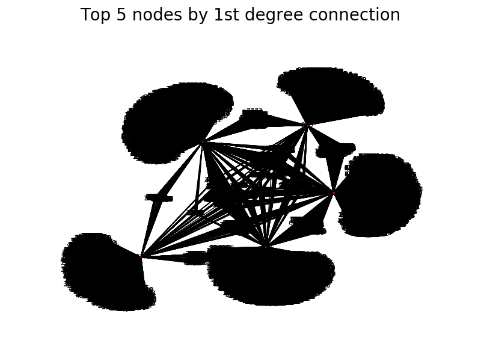

# Table of Contents

1. [Challenge Summary] (README.md#challenge-summary)
2. [Description of Data] (README.md#description-of-data)
3. [Solution] (README.md#solution)
4. [Repo directory structure] (README.md#repo-directory-structure)
4. [Result] (README.md#result)

### Challenge Summary

Imagine you're a data engineer at a "digital wallet" company called PayMo that allows users to easily request and make payments to other PayMo users. The team at PayMo has decided they want to implement features to prevent fraudulent payment requests from untrusted users. 

#### Feature 1
When anyone makes a payment to another user, they'll be notified if they've never made a transaction with that user before.

* "unverified: You've never had a transaction with this user before. Are you sure you would like to proceed with this payment?"

#### Feature 2
The PayMo team is concerned that these warnings could be annoying because there are many users who haven't had transactions, but are still in similar social networks. 

For example, User A has never had a transaction with User B, but both User A and User B have made transactions with User C, so User B is considered a "friend of a friend" for User A.

For this reason, User A and User B should be able to pay each other without triggering a warning notification since they're "2nd degree" friends. 

To account for this, PayMo would like you to also implement this feature. When users make a payment, they'll be notified when the other user is outside of their "2nd-degree network".

* "unverified: This user is not a friend or a "friend of a friend". Are you sure you would like to proceed with this payment?"

#### Feature 3
More generally, PayMo would like to extend this feature to larger social networks. Implement a feature to warn users only when they're outside the "4th degree friends network".

In the above diagram, payments have transpired between User

* A and B 
* B and C 
* C and D 
* D and E 
* E and F

Under this feature, if User A were to pay User E, there would be no warning since they are "4th degree friends". 

However, if User A were to pay User F, a warning would be triggered as their transaction is outside of the "4th-degree friends network."

(Note that if User A were to pay User C instead, there would be no warning as they are "2nd-degree" friends and within the "4th degree network") 

### Description of Data

[Back to Table of Contents] (README.md#table-of-contents)

The `batch_payment.txt` and `stream_payment.txt` input files are formatted the same way.

As you would expect of comma-separated-value files, the first line is the header. It contains the names of all of the fields in the payment record. In this case, the fields are 

* `time`: Timestamp for the payment 
* `id1`: ID of the user making the payment 
* `id2`: ID of the user receiving the payment 
* `amount`: Amount of the payment 
* `message`: Any message the payer wants to associate with the transaction

Following the header, you can assume each new line contains a single new PayMo payment record with each field delimited by a comma. In some cases, the field can contain Unicode as PayMo users are fond of placing emojis in their messages. For simplicity's sake, you can choose to ignore those emojis.

For example, the first 10 lines (including the header) of `batch_payment.txt` or `stream_payment.txt` could look like: 

    time, id1, id2, amount, message
    2016-11-02 09:49:29, 52575, 1120, 25.32, Spam
    2016-11-02 09:49:29, 47424, 5995, 19.45, Food for  
    2016-11-02 09:49:29, 76352, 64866, 14.99, Clothing
    2016-11-02 09:49:29, 20449, 1552, 13.48, LoveWins
    2016-11-02 09:49:29, 28505, 45177, 19.01, 
    2016-11-02 09:49:29, 56157, 16725, 4.85, 5
    2016-11-02 09:49:29, 25036, 24692, 20.42, Electric
    2016-11-02 09:49:29, 70230, 59830, 19.33, Kale Salad
    2016-11-02 09:49:29, 63967, 3197, 38.09, Diner
     

### Repo directory structure
[Back to Table of Contents] (README.md#table-of-contents)

Repo Structure

    ├── README.md 
    ├── run.sh
    ├── src
    │      └── antifraud.py
    │      └── mapnetwork.py
    ├── paymo_input
    │   └── batch_payment.txt
    |   └── stream_payment.txt
    ├── paymo_output
    │   └── output1.txt
    |   └── output2.txt
    |   └── output3.txt
    └── insight_testsuite
            ├── run_tests.sh
           └── tests
                └── test-1-paymo-trans
                │   ├── paymo_input
                │   │   └── batch_payment.txt
                │   │   └── stream_payment.txt
                │   └── paymo_output
                │       └── output1.txt
                │       └── output2.txt
                │       └── output3.txt
                └── krishna-own-test
                     ├── paymo_input
                     │   └── batch_payment.txt
                     │   └── stream_payment.txt
                     └── paymo_output
                         └── output1.txt
                         └── output2.txt
                         └── output3.txt

### Solution

[Back to Table of Contents] (README.md#table-of-contents)

We have a record of existing customers and their transactions. Each user has a unique identification number, and thus we can use this as a key to store information about this user.

There are many ways to go about the problem. I decided to use a dictionary to make decisions for feature 1 and feature 2, primarily because this method is much faster than the alternatives that I am aware of. Dictionary holds `user ==> set(past_transactions)`. 

If `A` and `B` had transactions with each other, `A` shows up in `B`'s children, and `B` shows up in `A`'s children. Elements in `A_child, B_child` are unique because they're stored on a set. As such, one can simply ask `if A in B` to figure out if `A` and `B` had any transactions before.

Similarly, to find out if `A` and `B` are separated by 1 degree (have a common friend), we can get a list of A's child, B's child, and see if these two sets have any intersection via  `A_child.intersection(B_child)`. If the length of intersection >0, then A and B did have made transactions before.

For feature 3, I used networkx library to find the shortest path between two users. The object holding data, `G`, has a member function called `has_node` which tells whether G has a particular node. So, if G has both node A and B, and if A and B are connected, we can ask for the shortest length between nodes A and B. 

If a transaction is trusted (`A` and `B` exist, deg. of separation is <= 4), then this new transaction is added to existing network. For instance, If `A` and `E` are separated by deg. 4 and gets flagged as `trusted`, separation between `A` and `E` is now 1. In networkx language, I add edge (A,E) to G. For feature 1 and 2, I simply add each user to other's set of children ~ A.add(E), and E.add(A).

#### Edge cases
Few tricky cases that need to be taken care of. 

1. If A and B are same, flag `trusted`
2. If A and/or B are not present, flag `unverified`
3. If A and B are present, but not connected, flag `unverified`

#### Result
Following are the top 5 nodes, by the number of 1st degree friends they have.

Smaller blobs are the common nodes between the large nodes.

One interesting thing was that, even for 1 degree or 2-degree separation, the shortest_path from NetworkX took as much time as it did for >=4 degrees. So, I chose to simply use dictionary mapping to handle feature 1 and 2.

From the full data, `3938360` records gets loaded from the input file in about 10 seconds, out of which `77360` are unique users. This is tested against `2900805` transaction requests, which get flagged in 3 different ways.

`Number of unverifed transactions per feature {1: 1439961, 2: 639464, 3: 99189}`

`Top 5 nodes (node ==> #children):  [(2481, 3798), (4675, 3496), (394, 3458), (225, 2525), (377, 2425)]`

Avg. time spent on features per transaction is in the order of ~$10^{-6}$ for feature 1 and 2, and ~$~10^{-4}$ seconds for feature 3.
